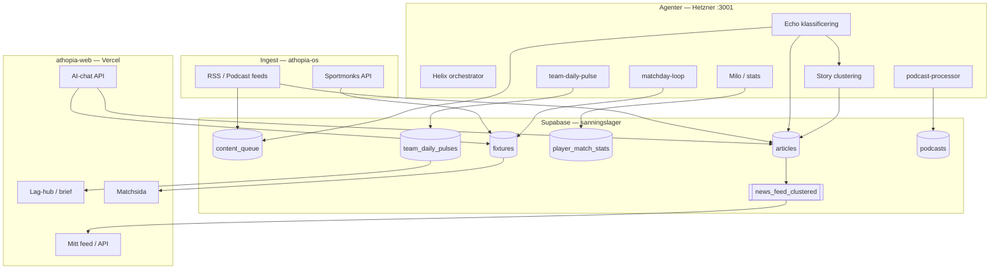

# Athopia — arkitekturritning

> **Princip:** Write-time intelligence (os), read-time presentation (web). Inga Sportmonks- eller RSS-anrop från klienter.

## Systemdiagram

## Lager

| Lager | Äger | Får inte |
|-------|------|----------|
| **Ingest** | athopia-os | Publicera rå RSS-text |
| **Intelligence** | athopia-os (Echo, Milo, Pulse) | Köra LLM i page requests |
| **Data** | Supabase | — |
| **Product** | athopia-web | Skriva Sportmonks, fabricera stats |
| **Control** | athopia-admin | Exponeras publikt utan auth |

## Kärntabeller & views

| Objekt | Skrivs av | Läses av web |
|--------|-----------|--------------|
| `content_queue` | RSS-ingest, Echo | Admin, sällan web |
| `articles` | Echo, narrative | `news_feed`, `/artikel` |
| `news_feed_clustered` | VIEW (dedup) | `/api/feed`, NewsStream |
| `story_clusters` | clustering.ts | Feed badges |
| `fixtures`, `live_scores` | Sportmonks sync | Match, tabell |
| `team_match_stats`, `player_match_stats` | normalize worker | Statistik, match |
| `team_daily_pulses` | team-daily-pulse | Lag-hub brief |
| `podcasts`, `podcast_chunks` | ingest + processor | Signaler only (ej chunks publikt) |
| `chat_usage` | web AI routes | Rate limits |
| `user_feed_config` | Clerk webhook | Feed filter |

## Agent-schedule (Hetzner)

| Jobb | Intervall | Fil |
|------|-----------|-----|
| RSS poll | 30 min | `packages/rss` |
| Podcast poll | 30 min | `podcast-ingest.ts` |
| Helix tick | 60 s | `helix.ts` |
| Task dispatcher | 15 s | `apps/agents/src/index.ts` |
| Echo rolling | cron | `echo-backfill.ts` |
| Sportmonks nightly | 04:00 | `nightlySync` |
| Team pulse | ~24 h | `team-daily-pulse.ts` |
| Matchday loop | 5 min | `matchday-loop.ts` |

## AI — två spår (viktigt)

| Spår | Budget | Plats |
|------|--------|-------|
| **Pipeline AI** | `withBudget()`, `agent_logs` | athopia-os |
| **User-facing chat** | `chat_usage`, $50/mån cap | athopia-web `/api/*/chat` |

→ Se [AI_FIX_GUIDE.md](./AI_FIX_GUIDE.md) för felsökning.

## Deploy-karta

| Yta | Host | Repo |
|-----|------|------|
| athopia.se | Vercel | athopia-web |
| os.athopia.se | Vercel | athopia-admin |
| Agenter | Hetzner 135.181.107.47 | athopia-os Docker |
| DB | Supabase fmwjmrtqvdxswlimroqx | migrations i os |
